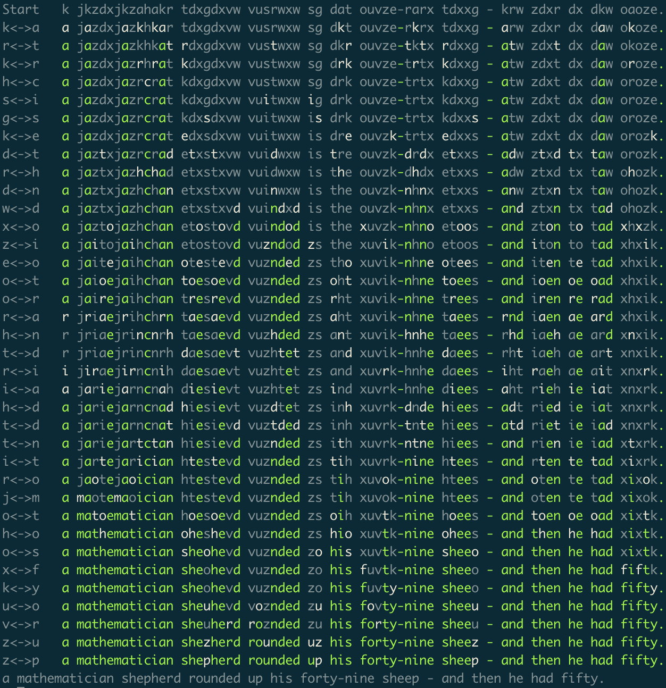

# cryptogram.py

A small tool to help you solve your cryptograms.

## Usage

This is built with Python 3. Use it from bash:

`./cryptogram.py <cryptogram_text>`

From there you'll get a prompt until you've solved the puzzle at hand
(which is up to you to determine).

At the prompt:

```
> XY  --> (any two letters); Swap letters X and Y in the working solution.
> r   --> Retype the original cryptogram text.
> f   --> Show letter frequency alongside English letter ranking.
> ?   --> Show help (this message).
> s   --> Shuffle all letters randomly.
> c   --> Show common short English words.
> h   --> Print an abbreviated work history, for sharing your process.
> q   --> Quit.
```

## Example

The example below mostly shows the usage. I'll include some comments I've added
after the fact; for those I've inserted #-delimited lines.
(Note that I actually took more time to originally solve this cryptogram!)

```
~/cryptogram$ ./cryptogram.py ycu wpvgd lpecx klx vpnc rtjn lqc fctnpv ajtg rjt ycyyctnkvl - yrcrrctnkvu.
> c

Common 2-letter words:
    of    to    in    it    is    be    as    at    so    we
    he    by    or    on    do    if    me    my    up    an
    go    no    us    am

Common 3-letter words:
    the   and   for   are   but   not   you   all   any   can
    had   her   was   one   our   out   day   get   has   him
    his   how   man   new   now   old   see   two   way   who
    boy   did   its   let   put   say   she   too   use

Common 4-letter words:
    that  with  have  this  will  your  from  they  know  want
    been  good  much  some  time

Common double letters:
    ss    ee    tt    ff    ll    mm    oo

# Note that rtjn and rjt share 3 letters. Using the common-word list, we
# can guess they are "from" and "for."

ycu wpvgd lpecx klx vpnc rtjn lqc fctnpv ajtg rjt ycyyctnkvl - yrcrrctnkvu.
> rf
ycu wpvgd lpecx klx vpnc ftjn lqc rctnpv ajtg fjt ycyyctnkvl - yfcffctnkvu.
> tr
ycu wpvgd lpecx klx vpnc frjn lqc tcrnpv ajrg fjr ycyycrnkvl - yfcffcrnkvu.
> jo
ycu wpvgd lpecx klx vpnc fron lqc tcrnpv aorg for ycyycrnkvl - yfcffcrnkvu.
> nm
ycu wpvgd lpecx klx vpmc from lqc tcrmpv aorg for ycyycrmkvl - yfcffcrmkvu.

# Pick one of the 3-letter words and guess that it's "the."

> lt
ycu wpvgd tpecx ktx vpmc from tqc lcrmpv aorg for ycyycrmkvt - yfcffcrmkvu.
> qh
ycu wpvgd tpecx ktx vpmc from thc lcrmpv aorg for ycyycrmkvt - yfcffcrmkvu.
> ce
yeu wpvgd tpcex ktx vpme from the lermpv aorg for yeyyermkvt - yfeffermkvu.

# At this point we're supposing we have "t" correct. Consider "ktx" - wht
# is the most common 3-letter word with t in middle? "its":

> ki
yeu wpvgd tpcex itx vpme from the lermpv aorg for yeyyermivt - yfeffermivu.
> xs
yeu wpvgd tpces its vpme from the lermpv aorg for yeyyermivt - yfeffermivu.

# Now we can guess that yeyyermivt is probably peppermint.

> yp
peu wyvgd tyces its vyme from the lermyv aorg for peppermivt - pfeffermivu.
> vn
peu wyngd tyces its nyme from the lermyn aorg for peppermint - pfefferminu.

# Probably "nyme" is "name".

> ya
peu wangd taces its name from the lerman yorg for peppermint - pfefferminu.

# Probably "taces" is "takes".

> ck
peu wangd takes its name from the lerman yorg for peppermint - pfefferminu.

# Probably "lerman" is "german".

> lg
peu wanld takes its name from the german yorl for peppermint - pfefferminu.
> yw

# From context, "yorl" is probably "word".

peu yanld takes its name from the german worl for peppermint - pfefferminu.
> ld

# Now I look up the German word for peppermint, which is pfefferminz.

peu yandl takes its name from the german word for peppermint - pfefferminu.
> uz

# And now I see that Pez is a candy (not a yandl).

pez yandl takes its name from the german word for peppermint - pfefferminz.
> yc
pez candl takes its name from the german word for peppermint - pfefferminz.
> ly
pez candy takes its name from the german word for peppermint - pfefferminz.

# And ... done!

> q
Have a great day! :D
```

## Example color-coded solution path

Below is a screenshot of a color-coded summary of me solving a puzzle.
These are fun to check out once you've solved a particular cryptogram. :)



